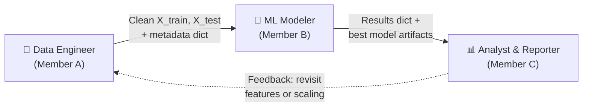
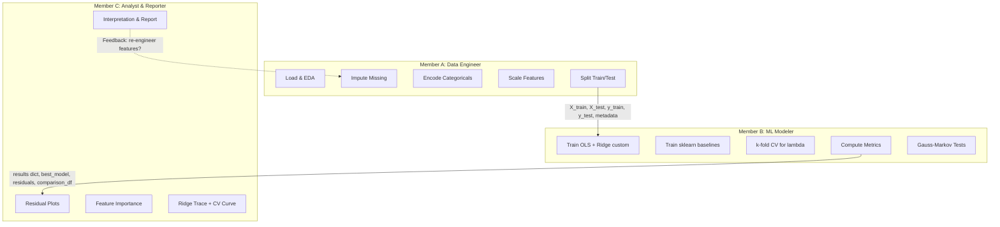
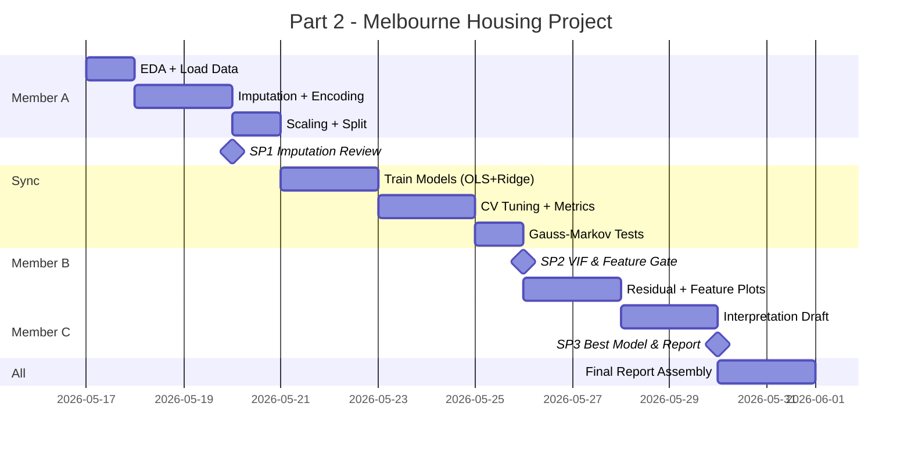

# Part 2 — Team Structure & Work Division

> **Project:** Data Fitting on Melbourne Housing Snapshot
> **Team Size:** 3 members
> **Architecture:** `data_pipeline.py` → `model_comparison.py` → `advanced_methods.py` + `part2_notebook.ipynb`

---

## The 3 Personas



---

## Persona 1: Data Engineer (Member A)

> **Ownership:** `data_pipeline.py`, `part2/data/`
> **Core Responsibility:** Deliver a clean, leakage-free, model-ready dataset.

### Tasks

| #   | Task                                                                                                                                               | Output                                                      |
| --- | -------------------------------------------------------------------------------------------------------------------------------------------------- | ----------------------------------------------------------- |
| A1  | Load Melbourne Housing CSV, perform initial EDA (shape, dtypes, distributions)                                                                     | EDA summary printed in notebook                             |
| A2  | Implement `DataPipeline.fit_transform()`: handle missing values in `BuildingArea` (~47%) and `YearBuilt` (~40%) using a chosen imputation strategy | Fitted pipeline object with stored `self.imputation_values` |
| A3  | Implement one-hot encoding for categorical columns (e.g., `Type`, `Regionname`). Store the resulting column list in `self.encoded_columns`         | Consistent column set across train/test                     |
| A4  | Implement feature scaling (standardization). Store `self.scalers` (mean, std per column)                                                           | Scaled `X_train`, `X_test` as NumPy arrays                  |
| A5  | Implement `DataPipeline.transform()` for the test set using **only** the fitted state                                                              | Transformed `X_test` with zero data leakage                 |
| A6  | Split data using `train_test_split()` (80/20, fixed `random_state`)                                                                                | `X_train, X_test, y_train, y_test` + `metadata` dict        |

### Deliverables (Handover to Member B)

```python
# The "Contract" from A → B
X_train: np.ndarray    # shape (n_train, p), scaled, no NaNs
X_test:  np.ndarray    # shape (n_test, p), scaled, no NaNs
y_train: np.ndarray    # shape (n_train,)
y_test:  np.ndarray    # shape (n_test,)
metadata: dict         # {
                       #   'feature_names': [...],
                       #   'target_name': 'Price',
                       #   'pipeline': fitted DataPipeline instance,
                       #   'imputation_strategy': 'median',
                       #   'scaling_method': 'standardize'
                       # }
```

---

## Persona 2: ML Modeler (Member B)

> **Ownership:** `model_comparison.py`, `cross_validation.py` (from Part 1)
> **Core Responsibility:** Train all regression models using self-written functions from Part 1, tune hyperparameters, and output a ranked performance comparison.

### Tasks

| #   | Task                                                                                                      | Output                                      |
| --- | --------------------------------------------------------------------------------------------------------- | ------------------------------------------- |
| B1  | Execute `ols_fit(X_train, y_train)` on the full design matrix as the baseline OLS model                   | `beta_hat_ols`, `y_pred_ols`                |
| B2  | Execute `ols_fit(X_train_best, y_train)` on the selected-feature matrix as the feature-selected OLS model | `beta_hat_best`, `y_pred_best`              |
| B3  | Run `kfold_cv` on $X_{train\_best}$ to find the optimal Ridge hyperparameter $\lambda$                    | `best_lambda`, CV score curve               |
| B4  | Execute `ridge_fit(X_train_best, y_train, lambda_best)` to obtain the optimized Ridge coefficients        | `beta_hat_ridge`, `y_pred_ridge`            |
| B5  | Execute the advanced `kernel_ridge_fit` model from `advanced_methods.py` on the dataset                   | `y_pred_kernel_ridge`, kernel model outputs |
| B6  | Compute MAE, RMSE, and $R^2$ on the test set for all 4 models and export a ranked comparison DataFrame    | Ranked comparison DataFrame                 |

### Deliverables (Handover to Member C)

```python
results = {
    'OLS_baseline': {
        'coefficients': np.ndarray,      # beta_hat_ols (full feature set)
        'predictions_test': np.ndarray,  # y_pred on X_test_full
        'metrics': {'MAE': ..., 'RMSE': ..., 'R2': ...}
    },
    'OLS_selected': {
        'coefficients': np.ndarray,      # beta_hat_best (selected features)
        'predictions_test': np.ndarray,  # y_pred on X_test_best
        'metrics': {'MAE': ..., 'RMSE': ..., 'R2': ...}
    },
    'Ridge_custom': {
        'coefficients': np.ndarray,      # beta_hat_ridge
        'predictions_test': np.ndarray,  # y_pred on X_test_best
        'metrics': {'MAE': ..., 'RMSE': ..., 'R2': ...},
        'best_lambda': float
    },
    'Kernel_Ridge': {
        'predictions_test': np.ndarray,  # y_pred from nonlinear Gram matrix
        'metrics': {'MAE': ..., 'RMSE': ..., 'R2': ...},
        'best_lambda_kernel': float
    }
}

best_model_name: str # e.g., 'Ridge_custom_lambda_0.5'
best_beta: np.ndarray # Coefficients of the best model
best_residuals: np.ndarray # y_test - y_pred of the best model
best_lambda: float # Optimal lambda from CV
cv_scores: dict # {'lambda_values': [...], 'mean_scores': [...]}
gauss_markov_results: dict # {'Breusch-Pagan': p_val, 'VIF': df, ...}
comparison_df: pd.DataFrame # The formatted comparison table
```

---

## Persona 3: Analyst & Reporter (Member C)

> **Ownership:** `part2_notebook.ipynb`, `advanced_methods.py`, report sections
> **Core Responsibility:** Visualize, interpret, and write the narrative that ties the math to the real-world meaning.

### Tasks

| #   | Task                                                                                                                                        | Output                      |
| --- | ------------------------------------------------------------------------------------------------------------------------------------------- | --------------------------- |
| C1  | Plot the 4 residual diagnostic plots for the best model (Residuals vs Fitted, Q-Q, Scale-Location, Residuals vs Leverage)                   | 4-panel figure              |
| C2  | Plot standardized regression coefficients as a horizontal bar chart for feature importance                                                  | Feature importance figure   |
| C3  | Plot the Ridge Trace ($\lambda$ vs coefficients) and the CV error curve                                                                     | 2 figures                   |
| C4  | Interpret the comparison table: why did Ridge outperform OLS? What does $\lambda$ do to multicollinear features like `Rooms` vs `Bedroom2`? | Written analysis paragraphs |
| C5  | Interpret the Gauss-Markov test results: does heteroscedasticity exist? Is the normality assumption violated?                               | Written discussion          |
| C6  | Write the **Discussion & Conclusion** section: connect the math to the Melbourne housing market context                                     | Final report section        |
| C7  | (Bonus) Implement and evaluate Kernel Ridge or Bayesian Linear Regression in `advanced_methods.py`                                          | Advanced model results      |

### Deliverables (Final Output)

- Completed `part2_notebook.ipynb` with all figures, tables, and narrative
- Contribution to the LaTeX report in `report/`

---

## Contracts Summary



| Contract       | From  | To                         | Exact Artifact                                                                                                                                                      |
| -------------- | ----- | -------------------------- | ------------------------------------------------------------------------------------------------------------------------------------------------------------------- |
| **Contract 1** | A → B | Data Engineer → ML Modeler | `X_train`, `X_test`, `y_train`, `y_test` (NumPy arrays) + `metadata` dict containing feature names, pipeline instance, and preprocessing choices                    |
| **Contract 2** | B → C | ML Modeler → Analyst       | `results` dict (all models' coefficients, predictions, metrics), `best_residuals`, `best_beta`, `best_lambda`, `cv_scores`, `gauss_markov_results`, `comparison_df` |
| **Contract 3** | C → A | Analyst → Data Engineer    | Feedback loop: if residual analysis reveals issues (e.g., heteroscedasticity suggests log-transforming `Price`), request a pipeline re-run                          |

---

## Sync Points (Mandatory Joint Decisions)

### Sync Point 1: Imputation & Feature Engineering Review

> **When:** After Member A completes tasks A1–A3 (EDA + imputation + encoding)
> **Who:** All 3 members
> **Decision:** Agree on the imputation strategy for `BuildingArea` (47% missing) and `YearBuilt` (40% missing). Options: median fill, KNN imputer, or drop rows. Also decide whether to engineer new features (e.g., `Age = 2026 - YearBuilt`). This decision directly impacts the design matrix $X$ that Member B will model.

> [!IMPORTANT]
> This is the single most impactful decision in the project. If imputation is poor, every downstream model and metric is compromised.

### Sync Point 2: Multicollinearity & Feature Selection Gate

> **When:** After Member B runs VIF on the initial model (task B7, first pass)
> **Who:** All 3 members
> **Decision:** Review the VIF table. If `Rooms` and `Bedroom2` both have VIF > 10 (as our earlier synthetic test predicted), the team must jointly decide which to drop. This requires Member A to re-run the pipeline with the dropped column, and Member C to understand the interpretive consequences.

### Sync Point 3: Best Model Selection & Report Alignment

> **When:** After Member B completes the comparison table (task B6) and Member C has draft residual plots (task C1)
> **Who:** All 3 members
> **Decision:** Officially select the "best model" for the report. Is it the model with the lowest RMSE? Or should we prefer a simpler model (OLS) if its $R^2$ is only marginally worse than Ridge? Also align on the narrative: what story does the report tell?

---

## Suggested Timeline


