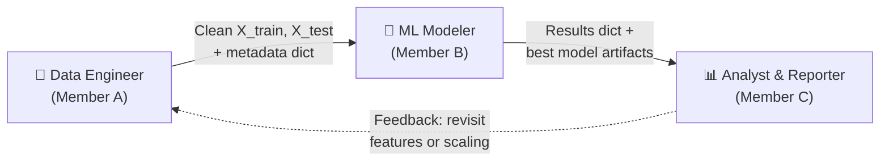
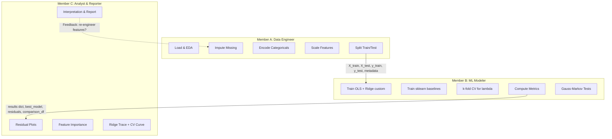
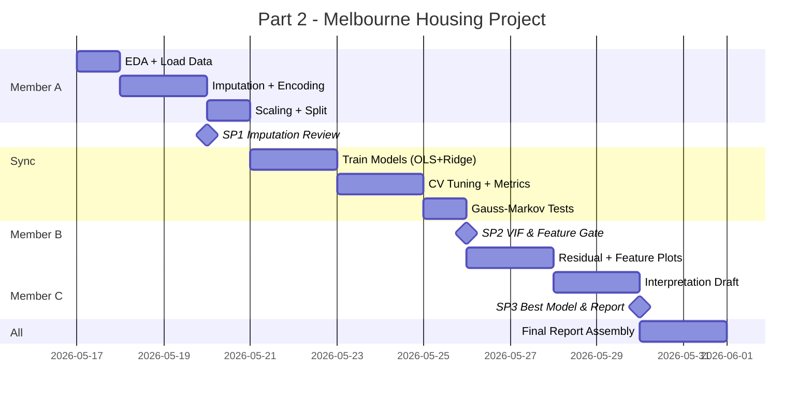

# Part 2 — Team Structure & Work Division

> **Project:** Data Fitting on Melbourne Housing Snapshot
> **Team Size:** 3 members
> **Architecture:** `data_pipeline.py` → `model_comparison.py` → `advanced_methods.py` + `part2_notebook.ipynb`

---

## The 3 Personas



---

## Persona 1: Data Engineer (Member A)

> **Ownership:** `data_pipeline.py`, `part2/data/`
> **Core Responsibility:** Deliver a clean, leakage-free, model-ready dataset by strictly applying transformations _after_ splitting the data.

### Tasks

| #   | Task                                                                                                                                       | Corresponding Function                                     | Output                                               |
| --- | ------------------------------------------------------------------------------------------------------------------------------------------ | ---------------------------------------------------------- | ---------------------------------------------------- |
| A1  | Load the Melbourne Housing CSV and run an initial Exploratory Data Analysis (shape, dtypes, missing ratios, outliers detection).           | `load_data()`, `perform_eda()` (or Notebook cells)         | EDA summary printed in the notebook                  |
| A2  | Split the raw data into training and testing sets (70/30, fixed random state) **before** any preprocessing to guarantee zero data leakage. | `train_test_split()`                                       | `X_train_raw`, `X_test_raw`, `y_train`, `y_test`     |
| A3  | Implement missing value imputation (e.g., k-NN imputer for `BuildingArea`) and store the learned patterns.                                 | `DataPipeline._impute_missing()`                           | Imputation values saved in pipeline state            |
| A4  | Implement categorical encoding (One-Hot) and feature engineering (e.g., non-linear log transforms or creating Age = 2026 - YearBuilt).     | `DataPipeline._encode_categoricals()`                      | Consistent `self.encoded_columns` list               |
| A5  | Implement feature scaling (Standardization) and store the mean/std parameters.                                                             | `DataPipeline._scale_features()`                           | Scaler parameters saved in `self.scalers`            |
| A6  | Execute the full preprocessing pipeline: apply `fit_transform` strictly on the Train set, and apply `transform` on the Test set.           | `DataPipeline.fit_transform()`, `DataPipeline.transform()` | Cleaned `X_train`, `X_test` + metadata dict handover |

### Deliverables (Handover to Member B)

```python
# The "Contract" from A → B
X_train: np.ndarray    # shape (n_train, p), scaled, encoded, no NaNs
X_test:  np.ndarray    # shape (n_test, p), scaled, encoded, no NaNs
y_train: np.ndarray    # shape (n_train,)
y_test:  np.ndarray    # shape (n_test,)
metadata: dict         # {
                       #   'feature_names': [...],
                       #   'target_name': 'Price',
                       #   'pipeline': fitted DataPipeline instance,
                       #   'imputation_strategy': 'knn_imputer',
                       #   'scaling_method': 'standardize'
                       # }
```

---

## Persona 2: ML Modeler (Member B)

> **Ownership:** `model_comparison.py`, `cross_validation.py` (from Part 1)

> **Core Responsibility:** Train all regression models using self-written functions from Part 1, tune hyperparameters, and output a ranked performance comparison.

### Tasks

| #   | Task                                                                                                                                               | Corresponding Function                                                      | Output                                                         |
| --- | -------------------------------------------------------------------------------------------------------------------------------------------------- | --------------------------------------------------------------------------- | -------------------------------------------------------------- |
| B1  | Run initial statistical diagnostics on the raw training data to detect multicollinearity and evaluate feature significance for the selection gate. | `run_diagnostics()` (invokes Part 1 `ols_fit`, `vif`, `coef_inference`)     | Initial VIF table, t-statistics, and p-values for Phase 1 loop |
| B2  | Train the baseline OLS model on the full raw feature set inside the main training pipeline execution.                                              | `train_models()` (invokes Part 1 `ols_fit`)                                 | Baseline `beta_hat_ols` and raw test predictions               |
| B3  | Train the feature-selected OLS model on the optimized feature set ($X_{train\_best}$) after removing collinear variables.                          | `train_models()` (invokes Part 1 `ols_fit`)                                 | Selected `beta_hat_best` and optimized test predictions        |
| B4  | Tune the Ridge regression hyperparameter $\lambda$ using K-Fold Cross-Validation on the best feature matrix.                                       | `hyperparameter_tuning()` (invokes Part 1 `kfold_cv`)                       | `best_lambda` and CV error curve data points                   |
| B5  | Train the optimized Ridge Regression model on the best feature matrix using the tuned $\lambda$ parameter.                                         | `train_models()` (invokes Part 1 `ridge_fit`)                               | Optimized `beta_hat_ridge` and test predictions                |
| B6  | Train the advanced non-linear Kernel Ridge Regression model as the competitive non-linear baseline.                                                | `train_models()` (invokes `kernel_ridge_fit` from `advanced_methods.py`)    | `y_pred_kernel_ridge` and non-linear kernel artifacts          |
| B7  | Compute test performance metrics (MAE, RMSE, $R^2$) for all models and generate the final evaluation ranking.                                      | `train_models()` (utilizes nested `compute_metrics`) & `comparison_table()` | Ranked performance comparison DataFrame for Member C           |

### Deliverables (Handover to Member C)

```python
results = {
    'OLS_baseline': {
        'coefficients': np.ndarray,      # beta_hat_ols (full feature set)
        'predictions_test': np.ndarray,  # y_pred on X_test_full
        'metrics': {'MAE': ..., 'RMSE': ..., 'R2': ...}
    },
    'OLS_selected': {
        'coefficients': np.ndarray,      # beta_hat_best (selected features)
        'predictions_test': np.ndarray,  # y_pred on X_test_best
        'metrics': {'MAE': ..., 'RMSE': ..., 'R2': ...}
    },
    'Ridge_custom': {
        'coefficients': np.ndarray,      # beta_hat_ridge
        'predictions_test': np.ndarray,  # y_pred on X_test_best
        'metrics': {'MAE': ..., 'RMSE': ..., 'R2': ...},
        'best_lambda': float
    },
    'Kernel_Ridge': {
        'predictions_test': np.ndarray,  # y_pred from nonlinear Gram matrix
        'metrics': {'MAE': ..., 'RMSE': ..., 'R2': ...},
        'best_lambda_kernel': float
    }
}

best_model_name: str # e.g., 'Ridge_custom_lambda_0.5'
best_beta: np.ndarray # Coefficients of the best model
best_residuals: np.ndarray # y_test - y_pred of the best model
best_lambda: float # Optimal lambda from CV
cv_scores: dict # {'lambda_values': [...], 'mean_scores': [...]}
gauss_markov_results: dict # {'Breusch-Pagan': p_val, 'VIF': df, ...}
comparison_df: pd.DataFrame # The formatted comparison table
```

---

## Persona 3: Analyst & Reporter (Member C)

> **Ownership:** `part2_notebook.ipynb`, `advanced_methods.py`, report sections
> **Core Responsibility:** Make data-driven feature selection decisions, visualize results, and write the narrative that ties the math to the real-world meaning.

### Tasks

| #   | Task                                                                                                                                                                                                            | Corresponding Tool/Function                               | Output                                       |
| --- | --------------------------------------------------------------------------------------------------------------------------------------------------------------------------------------------------------------- | --------------------------------------------------------- | -------------------------------------------- |
| C1  | **[Phase 1]** Analyze the initial diagnostics (VIF, p-values) provided by Member B to detect multicollinearity. Decide which features to drop and instruct Member A to update the `drop_columns` configuration. | Jupyter Notebook (Reviewing B's `run_diagnostics` output) | Finalized `drop_columns` list (Sync Point 2) |
| C2  | **[Phase 2]** Plot the 4 residual diagnostic plots for the best model to evaluate Gauss-Markov assumptions (Residuals vs Fitted, Q-Q, Scale-Location, Residuals vs Leverage).                                   | `residual_plots()` (from Part 1)                          | 4-panel diagnostic figure                    |
| C3  | Plot standardized regression coefficients as a horizontal bar chart to illustrate feature importance.                                                                                                           | `plot_coefficients()`                                     | Feature importance figure                    |
| C4  | Plot the Ridge Trace ($\lambda$ vs coefficients) and the CV error curve to demonstrate the regularization effect.                                                                                               | Matplotlib / Seaborn                                      | 2 hyperparameter figures                     |
| C5  | Interpret the evaluation metrics and the comparison table. Explain mathematically and practically why Ridge outperformed (or underperformed) OLS.                                                               | Written Analysis (Markdown/Typst)                         | Analytical paragraphs                        |
| C6  | Interpret the Gauss-Markov test results (e.g., Breusch-Pagan). Discuss the presence of heteroscedasticity and its impact on the model's reliability for high-priced houses.                                     | Written Analysis (Markdown/Typst)                         | Statistical discussion                       |
| C7  | Write the **Discussion & Conclusion** section: connect the mathematical findings back to the Melbourne housing market context.                                                                                  | Written Analysis (Markdown/Typst)                         | Final report section                         |
| C8  | **[Bonus]** Implement the core mathematical logic for Kernel Ridge or Bayesian Linear Regression. Handoff this function to Member B to execute inside the `train_models` pipeline.                              | `advanced_methods.py`                                     | Advanced model functions                     |

### Deliverables (Final Output)

- Completed `part2_notebook.ipynb` with all figures, tables, and narrative
- Contribution to the LaTeX report in `report/`

---

## Contracts Summary



| Contract       | From  | To                         | Exact Artifact                                                                                                                                                      |
| -------------- | ----- | -------------------------- | ------------------------------------------------------------------------------------------------------------------------------------------------------------------- |
| **Contract 1** | A → B | Data Engineer → ML Modeler | `X_train`, `X_test`, `y_train`, `y_test` (NumPy arrays) + `metadata` dict containing feature names, pipeline instance, and preprocessing choices                    |
| **Contract 2** | B → C | ML Modeler → Analyst       | `results` dict (all models' coefficients, predictions, metrics), `best_residuals`, `best_beta`, `best_lambda`, `cv_scores`, `gauss_markov_results`, `comparison_df` |
| **Contract 3** | C → A | Analyst → Data Engineer    | Feedback loop: if residual analysis reveals issues (e.g., heteroscedasticity suggests log-transforming `Price`), request a pipeline re-run                          |

---

## Sync Points (Mandatory Joint Decisions)

### Sync Point 1: Imputation & Feature Engineering Review

> **When:** After Member A completes tasks A1–A3 (EDA + imputation + encoding)
> **Who:** All 3 members
> **Decision:** Agree on the imputation strategy for `BuildingArea` (47% missing) and `YearBuilt` (40% missing). Options: median fill, KNN imputer, or drop rows. Also decide whether to engineer new features (e.g., `Age = 2026 - YearBuilt`). This decision directly impacts the design matrix $X$ that Member B will model.

> [!IMPORTANT]
> This is the single most impactful decision in the project. If imputation is poor, every downstream model and metric is compromised.

### Sync Point 2: Multicollinearity & Feature Selection Gate

> **When:** After Member B runs VIF on the initial model (task B7, first pass)
> **Who:** All 3 members
> **Decision:** Review the VIF table. If `Rooms` and `Bedroom2` both have VIF > 10 (as our earlier synthetic test predicted), the team must jointly decide which to drop. This requires Member A to re-run the pipeline with the dropped column, and Member C to understand the interpretive consequences.

### Sync Point 3: Best Model Selection & Report Alignment

> **When:** After Member B completes the comparison table (task B6) and Member C has draft residual plots (task C1)
> **Who:** All 3 members
> **Decision:** Officially select the "best model" for the report. Is it the model with the lowest RMSE? Or should we prefer a simpler model (OLS) if its $R^2$ is only marginally worse than Ridge? Also align on the narrative: what story does the report tell?

---

## Suggested Timeline


